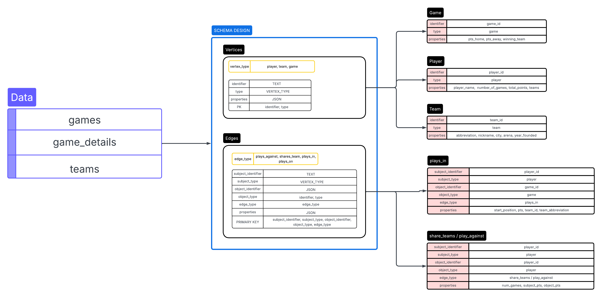

# 🏀 NBA Player Relationship Analysis using Graph Data Modeling

## Project Overview
This project demonstrates the power and efficiency of modeling complex, interconnected data using a Graph Data Model approach within a traditional relational database environment (PostgreSQL). The core goal is to shift from expensive, real-time calculation via complex SQL JOIN operations to fast lookups on pre-aggregated Edges.

By transforming row-level NBA game statistics into a network of Vertices (Nodes) and Edges (Relationships), we unlock highly efficient analysis of player dynamics and head-to-head performance.

## 💾Data Model Focus
We map the basketball world onto a graph structure where key entities are stored as Vertices, and their interactions are stored as Edges. Crucially, the Edges store pre-computed, aggregated statistics, eliminating the need for multi-join calculations at query time.

| Component | Role | Example |
| :--- | :--- | :--- |
| **Vertices** | Entities (Players, Teams, Games) | LeBron James, Golden State Warriors, Game ID 20230308 |
| **Edges** | Relationships and Aggregates | `plays_against`, `shares_team`, `plays_in` |

## 🔗 Key Relationships Modeled

The project focuses on building sophisticated, derived relationships and storing the results directly on the edge properties:

| Edge Type | Relationship | Properties Stored (Aggregated Data) |
| :--- | :--- | :--- |
| **`plays_against`** | Player vs. Opponent | Total points scored by Subject Player against Object Player, Total games played head-to-head. |
| **`shares_team`** | Player as Teammate | Total games played together, Combined statistics. |
| **`plays_in`** | Player in Game | Player's performance in that specific game (single-game stats). |

## 🚀 Technical Stack & Benefit

* **Database:** PostgreSQL
* **Graph Implementation:** Pure **SQL** and the **JSONB** data type (used for flexible storage of relationship properties).
* **Key Benefit:** We can answer complex analytical questions—such as *"Is Player A's average score higher when playing against Player B than their career average?"*—with a simple `JOIN Vertices ON Edges`, bypassing the need for computationally expensive self-joins on millions of raw game records. This provides **massive performance gains** for deep relational queries.

## Flowchart

